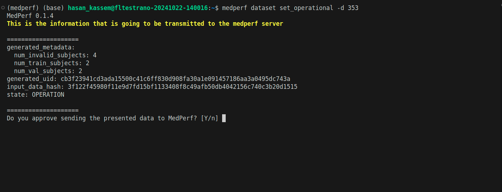

# Running Evaluation (Command Line Interface)

This guide assumes you finished preparing your dataset and reached [this step](https://docs.google.com/document/d/1731zXXb6ZRe6Nx5wnKBHZOdfEoTiTMAq/edit#heading=h.w0nnera5osyy). To start evaluation, please follow the steps below.

**Note: It is highly recommended to instead follow the [Web UI instructions](./evaluation_webui.md) if you are able to use a local Web interface. The Command line interface is fine if you are not able to use a local web interface, but the web interface is much more user friendly and intuitive.**

## Important steps for the Evaluation Phase

For the evaluation phase to happen smoothly without interruption, and to minimize your interaction with the software, please do the following before starting with the instructions below:

- Delete the MedPerf logs to avoid any unexpected disk space shortage issue, by running the following:

```bash
rm ~/.medperf_logs/*
```

## Outline

The instructions will cover the following steps:

1. Update MedPerf if needed
2. Authentication with the MedPerf server.
3. Setting your GPUs and your container platform (docker or singularity) if necessary.
4. Finding your dataset ID.
5. Setting your dataset as Operational.
6. Associating your dataset with the inference experiment (i.e., the benchmark).
7. Running inference.
8. Submitting the inference results to the MedPerf server.

We also include at the end what to do in case something goes wrong.

## 1. Update MedPerf if Needed

Navigate to your MedPerf repository folder that you cloned before. Run the following:

```bash
medperf --version
```

If the version is `0.1.5`, then run:

```bash
git pull
pip install -e ./cli --force-reinstall --no-cache
```

If the version is not `0.1.5`, then you have to run the following:

```bash
git remote add mlc https://github.com/mlcommons/medperf
git fetch mlc
git checkout -b inference mlc/main
pip install -e ./cli --force-reinstall --no-cache
```

Then verify again if the version becomes `0.1.5`.

## 2. Authentication with the MedPerf server

To avoid login session expiration later, you should re-authenticate now unless you recall that the last time you logged in was less than two weeks ago.

Run the following first to logout:

```bash
medperf auth logout
```

Then, login by running the following command:

```bash
medperf auth login
```

and follow the instructions [documented here](https://docs.medperf.org/concepts/auth/).

## 3. Check your settings (GPUs and Container technology)

Run the following to check your settings:

```bash
medperf profile view
```

Make sure:

- That the `platform` field is either `docker` or `singularity`, whichever you want to use.
- That the `gpus` argument is set correctly. For inference to use GPUs, you need to set the argument here, either `device=<ID>` to use a specific gpu ID from your machine (e.g., `device=0` to use your GPU of ID 0), or `all`, to use all gpus, or just an integer, to set a specific gpu count. Note that for singularity users, setting a GPU count is not supported.

For example, to set your platform as `singularity`:

```bash
medperf profile set --platform singularity
```

To set your GPU config to `device=0` (i.e., device ID 0):

```bash
medperf profile set --gpus "device=0"
```

## 4. Find your dataset ID

You may already know your dataset ID since you were doing data preparation before. As a reminder, you can find your dataset ID by running the following command:

```bash
medperf dataset ls --mine
```

## 5. Mark your dataset as Operational

Run the following command to mark your dataset as Operational (i.e., ready for inference):

```bash
medperf dataset set_operational -d YOUR_DATASET_ID
```

Replace `YOUR_DATASET_ID` with your dataset ID. This command will calculate the hash of your prepared dataset and some statistics. You will be presented with this information, and will be prompted to confirm uploading them to the MedPerf server. Type `Y` then press `Enter` to confirm.



## 6. Associate your dataset with the benchmark

Running the command in this section should be left running for a long period of time. Make sure that you can keep your terminal open without interruptions, or use tools like tmux to run the command in a terminal window that you can detach.

**Note: This command will run a compatibility test on your dataset and will take a long time to finish, depending on your dataset size and GPU. As a rule of thumb, it will take 5-6mins per dataset record. So for example, if your dataset has 50 subjects and each subject has 2 timepoints, then your dataset has 100 records and the test will take about 600mins (10 hours). After the test finishes, you will be presented with the results of the test and prompted to confirm. You can skip the confirmation step by adding a flag `-y` to the command.**

After marking your dataset as operational, run the following command so that your dataset is linked to the benchmark (inference) experiment:

```bash
medperf dataset associate -b 34 -d YOUR_DATASET_ID
```

To skip the confirmation step at the end, run the command as follows (with the `-y` flag):

```bash
medperf dataset associate -b 34 -d YOUR_DATASET_ID -y
```

Replace `YOUR_DATASET_ID` with your dataset ID.

The command first will pull the reference model and the metrics containers before starting the test. This may take some time depending on your internet connectivity. It will test your dataset compatibility by running the reference model on your dataset then calculate inference metrics. At some point your terminal will show you the following:


And after the command finishes, you will be prompted to confirm if you didn't use the `-y` flag. At the end, your terminal will show something as follows:


## 7. Start Inference

Running the command in this section should be left running for a long period of time. Make sure that you can keep your terminal open without interruptions, or use tools like tmux to run the command in a terminal window that you can detach.

Now run the following command to start inference: (Replace `YOUR_DATASET_ID` with your dataset ID.)

```bash
medperf benchmark run -b 34 -d YOUR_DATASET_ID
```

Please leave this running. This will take a long time to finish, depending on your dataset size and GPU. As a rule of thumb, it will take ~5-6mins per dataset record to run a single model, and 7-8 minutes per dataset record to run the ensemble model. The models will run sequentially.

So for example, if your dataset has 50 subjects and each subject has 2 timepoints, then your dataset has 100 records and the inference of all remaining models will take about 2000mins (~33 hours).

The command first will pull the model containers before starting the inference (BraTS baseline model, Final trained model, and an ensemble model of multiple trained models). It may take some time depending on your internet connectivity. At some point your terminal will show you the following:


And after the command finishes, your terminal will show something similar to the following (Execution IDs in your case will be different):


## 8. Upload inference results (metrics)

After inference on all models is finished in section 7, individual results of each model are created locally only. You should now upload them to the medperf server.

There are four models in total, so there are four results. The models IDs are `194`, `195`, `196`, and `197`. In order to upload a result, run the following:

```bash
medperf result submit -b 34 -d YOUR_DATASET_ID -m THE_MODEL_ID
```

Replace `YOUR_DATASET_ID` with your dataset ID, and `THE_MODEL_ID` with the model ID (one of `194`, `195`, `196`, `197`). You will be presented with the result (it's too long), and you will be prompted to confirm uploading it to the MedPerf server:

You will be presented with the result, and you will be prompted to confirm. Please do this for all your results. Also, if you want to skip the confirmation prompt, add `-y` to the command. Here are the commands that you will be running (replace `YOUR_DATASET_ID` with your dataset ID):

```bash
medperf result submit -b 34 -d YOUR_DATASET_ID -m 194
medperf result submit -b 34 -d YOUR_DATASET_ID -m 195
medperf result submit -b 34 -d YOUR_DATASET_ID -m 196
medperf result submit -b 34 -d YOUR_DATASET_ID -m 197
```

With the `-y` flag, the commands will become as follows:

```bash
medperf result submit -b 34 -d YOUR_DATASET_ID -m 194 -y
medperf result submit -b 34 -d YOUR_DATASET_ID -m 195 -y
medperf result submit -b 34 -d YOUR_DATASET_ID -m 196 -y
medperf result submit -b 34 -d YOUR_DATASET_ID -m 197 -y
```

This is an example screenshot when the command is run and waits for your confirmation:


This concludes the inference experiment. Thanks for your participation!

## Help: Error encountered

You may encounter an error at some point, could be during setting your dataset operational, during association, or inference.

When an error occurs and you are unable to resolve it, please contact us using the the following email: <hasan.kassem@mlcommons.org>

To make sure we can help you faster, please attach to your email the following logs files:

- `~/.medperf_logs/medperf_logs.tar.gz`
- `~/.medperf_logs/medperf.log`
- `~/.medperf_logs/medperf_webui.log` (If available)
