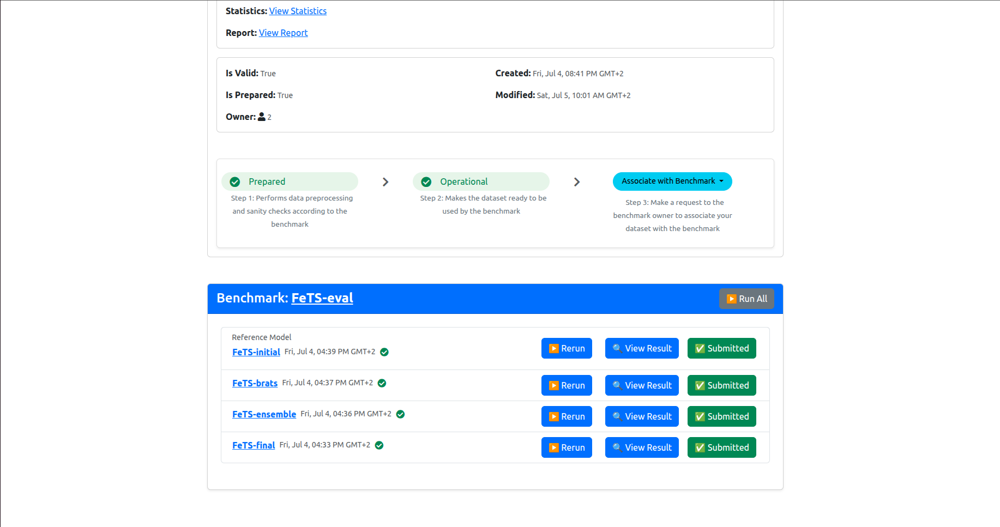

# Running Evaluation

This guide assumes you finished preparing your dataset and reached [this step](https://docs.google.com/document/d/1731zXXb6ZRe6Nx5wnKBHZOdfEoTiTMAq/edit#heading=h.w0nnera5osyy). To start evaluation, please follow the steps below.

## Important steps for the Evaluation Phase

For the evaluation phase to happen smoothly without interruption, and to minimize your interaction with the software, please do the following before starting with the instructions below:

- Delete the MedPerf logs to avoid any unexpected disk space shortage issue, by running the following:

```bash
rm ~/.medperf_logs/*
```

## Outline

The instructions will cover the following steps:

0. Update MedPerf if needed
1. Running the MedPerf Web UI.
2. Authentication with the MedPerf server.
3. Setting your GPUs and your container platform (docker or singularity) if necessary.
4. Opening your dataset dashboard.
5. Setting your dataset as Operational.
6. Associating your dataset with the inference experiment (i.e., the benchmark).
7. Running inference.
8. Submitting the inference results to the MedPerf server.

We also include at the end what to do in case something goes wrong.

## 0. Update MedPerf if Needed

Navigate to your MedPerf repository folder that you cloned before. Run the following:

```bash
medperf --version
```

If the version is `0.1.5`, then you just have to run `git pull`.

If the version is not `0.1.5`, then you have to run the following:

```bash
git remote add mlc https://github.com/mlcommons/medperf
git fetch mlc
git checkout -b inference mlc/main
```

Then verify again if the version becomes `0.1.5`.

## 1. Run the Web UI

For an easier interaction with the software, MedPerf now has a local web interface. The web application will run locally on localhost (so, there are no requirements for open ports on your system). Running the command that starts the web UI in this section should be left running for the whole time you are using MedPerf for inference. Make sure that you can keep your terminal open without interruptions, or use tools like tmux to run the command in a terminal window that you can detach.

Run the following:

```bash
medperf_webui
```

After a few seconds, the terminal will show something similar to the following:


You are presented with a security token to be used to access the web UI. To clear any confustion, this security token is **not related** to Authentication/login with MedPerf, but it's only a token that is used locally as another security layer. The web UI is only local, but for a further security protection, you have to paste the security token into the web UI page the first time you access it. Copy the security token, and open the link provided in the terminal (Usually <http://127.0.0.1:8100>).


As shown in the image above, when you open the provided localhost link, you will be prompted to enter the security token. Paste it, and proceed by clicking the `Access Web UI` button.

## 2. Authentication with the MedPerf server

After entering the security token, the next page you will see depends on your authentication state. You will be in one of the three cases below (with screenshots):

1) You may get a page showing you that you are not logged in, as shown below:


2) You may get a page showing you that your MedPerf account token has expired, as shown below:


3) You may get the landing page (benchmarks):


If you are in case 2), click the `logout` button on the top right to be redirected to the login page.

If you are in case 3), you are already logged in. However, to avoid login session expiration later, you should re-authenticate now unless you recall that the last time you logged in was less than two weeks ago. Click the `logout` button on the top right to be redirected to the login page.

Now to login to the MedPerf server, click on the `login` button on the top right corner. Then, enter your email address. Then, follow the instructions showing on the screen, similar to those below:


## 3. Check your settings

After logging in, navigate to the settings page by clicking on the `settings` button in the top right corner. **Don't change or activate the profile, keep it `default`**. Check if the GPUs argument and the platform argument are as expected:


- Platform should be `docker` or `singularity`, change it to set which container technology you will use.
- GPUs: for inference to use GPUs, you need to set the argument here, either type `device=<ID>` to use a specific gpu ID from your machine (e.g., `device=0` to use your GPU of ID 0), or type `all`, to use all gpus, or type just an integer, to set a specific gpu count. Note that for singularity users, setting a GPU count is not supported.

If you change something, click `Apply Changes` button to make sure the changes take effect.

## 4. Open your Dataset Dashboard

Assuming you are logged in and you made sure your settings are as expected, click on the `Datasets` tab in the navigation bar in the top left. You will see a list of datasets. Turn on the switch that says `show only my datasets` to make searching for your dataset easier:


Find your dataset card (you should be able to recognize which one it is, either from its ID or its name). Click on its name in blue to open its dashboard. In my case it is `fets_tutorial_data`. You will see the dashboard similar to the following:


## 5. Mark your Dataset as Operational

(If your dashboard shows that your dataset is already `OPERATION` and not `DEVELOPMENT`, skip this step.)

Now, click on the `Set Operational` button to set your dataset as operational (i.e., ready for inference). This will calculate the hash of your prepared dataset and some statistics. You will be presented with this information, and will be prompted to confirm uploading them to the MedPerf server, similar to the screenshot shown below:


Click `Yes`, and then proceed to the next step.

## 6. Associate your dataset with the benchmark

After marking your dataset as operational, the page will refresh and you will be able to associate with the benchmark:


Click on the `Associate with Benchamrk` button so that your dataset is linked to the benchmark (inference) experiment. Once you click, you will need to choose the benchmark. Most probably you will see only one bechmark available, named `FeTS-eval`:


Click on the blue button `Request Association`. This will run a compatibility test between your dataset and the benchmark:


The test will take some time, depending on your dataset size and GPU. As a rule of thumb, it will take 5-6mins per dataset record. So for example, if your dataset has 50 subjects and each subject has 2 timepoints, then your dataset has 100 records and the test will take about 600mins (10 hours).

Feel free to keep the web page open or close it and come back later. **However, don't close the terminal where the web UI is running**, as this will cancel any ongoing test.

If you close the web UI and want to be reminded later what URL you should enter to access the web UI, check the [last section](#help-access-the-web-ui-again).

### 6.1 Confirming the association

If you closed the web UI window, make sure to return back to your dataset dashboard as explained in [section 4 above](#4-open-your-dataset-dashboard)

If the test succeeded, you should see that the bottom of the page is similar to the following:


It will present you with the test results and ask you to confirm association and sending these test results to the MedPerf server. Click `Yes` to confirm.

## 7. Run Inference

Now you have your dataset associated with the benchmark. The page should have refreshed automatically and you should be able to see something similar to the following in the bottom of the dashboard:


These are the list of models included in the inference experiment. You should run them all.

Click on `Run All` to start inference. After clicking `Run All`, you should see something similar to the following:


Note that the "Initial FeTS model" was already ran during the association request, so it will not run now, so that's fine, even if the UI is showing a spinning circle on its `Rerun` button. You are not supposed to re-run it.

Please leave this running. This will take a long time to finish, depending on your dataset size and GPU. As a rule of thumb, it will take ~5-6mins per dataset record to run a single model, and 7-8 minutes per dataset record to run the ensemble model. The models will run sequentially.

So for example, if your dataset has 50 subjects and each subject has 2 timepoints, then your dataset has 100 records and the inference of all remaining models will take about 2000mins (~33 hours).

Feel free to keep the web page open or close it and come back later. **However, don't close the terminal where the web UI is running**, as this will cancel any ongoing execution.

If you close the web UI and want to be reminded later what URL you should enter to access the web UI, check the [last section](#help-access-the-web-ui-again).

### 7.1 After the inference is finished

You should see the page similar to the following after inference on all models is finished:


Now you are left with a quick final step to submit these inference results to the MedPerf server!

## 8. Upload results

Now you will have to upload each result individually. You should click on the `Submit` button next to each model. When you click one of the `Submit` buttons, you will get a confirmation prompt as follows:


Click `Yes` to confirm. Then the page will refresh and the associated model's results will be marked as `Submitted`. Please do this for each model results until you get them all submitted, as shown below:



This concludes the inference experiment. Thanks for your participation!

## Help: Error encountered

You may encounter an error at some point, could be during setting your dataset operational (section 5), during association (section 6), or inference (section 7).

When you encounter an error, you will get an error pop up box. For example, this could happen during inference if your GPU has an issue:


When an error occurs and you are unable to resolve it, please contact us using the the following email: <hasan.kassem@mlcommons.org>

To make sure we can help you faster, please attach to your email the following logs files:

- `~/.medperf_logs/medperf_logs.tar.gz` (If available)
- `~/.medperf_logs/medperf.log` (If available)
- `~/.medperf_logs/medperf_webui.log`

## Help: Access the web UI again

If you had closed your web UI window and want to access it again, please run the following command on a new terminal window:

```bash
medperf get_webui_properties
```

You will then see the URL to click on to access the web UI, and also the security token to use in case the web UI asks for it again (but usually it won't).

If you exited the web UI completely (for example, interrupted the terminal window where you ran the web UI), you can simply run the webui command again:

```bash
medperf_webui
```
