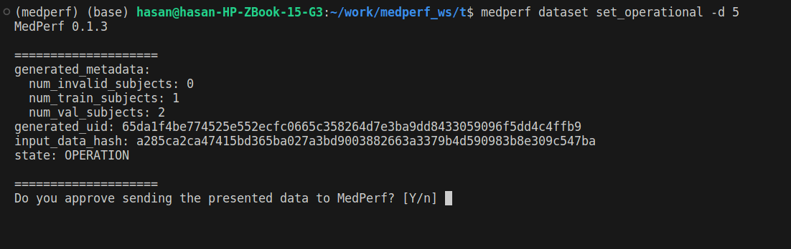
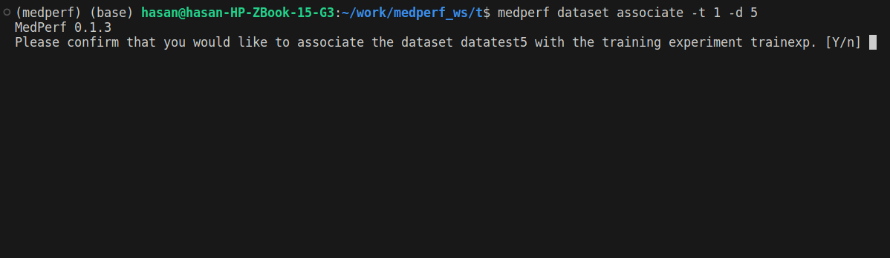
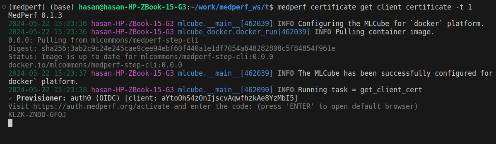
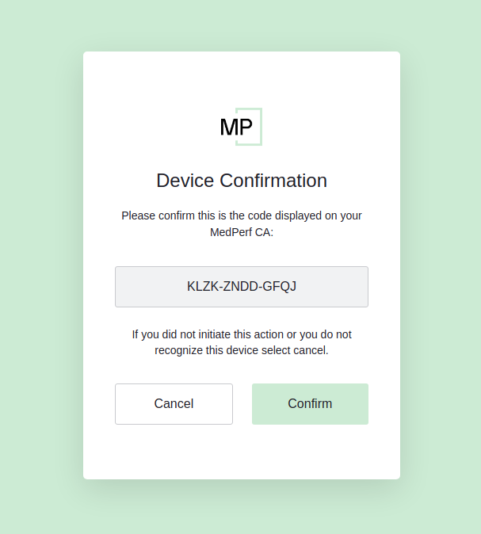
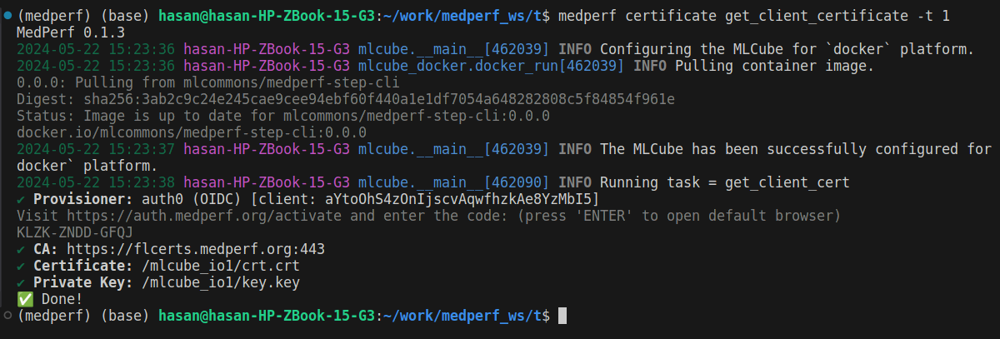
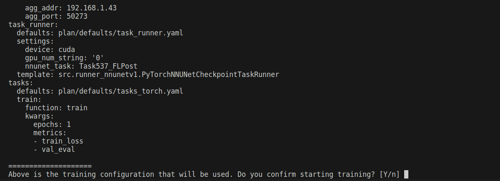
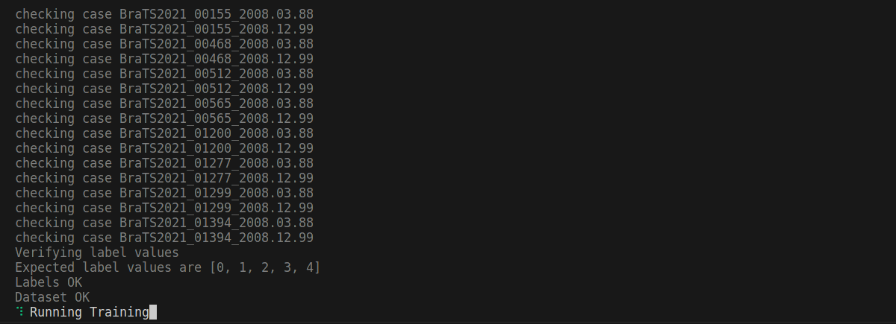

# Running Training

This guide assumes you finished preparing your dataset and reached [this step](https://docs.google.com/document/d/1731zXXb6ZRe6Nx5wnKBHZOdfEoTiTMAq/edit#heading=h.w0nnera5osyy). To start training, please follow the following steps:

## 0. Update your MedPerf Installation

The new MedPerf code has been moved to a new branch. To update your MedPerf installation:

1. Locate the folder where you had installed MedPerf before. Delete the folder:

```bash
rm -rf medperf/
```

2. Re-install MedPerf:

```bash
git clone https://github.com/hasan7n/medperf
cd medperf
git checkout fl-poc
pip install -e ./cli --force-reinstall
```

## 1. Mark your dataset as Operational

Run the following command to mark your dataset as Operational (i.e., ready for training):

```bash
medperf dataset set_operational -d DATASET_ID
```

Replace `DATASET_ID` with your dataset ID. This command will calculate the hash of your prepared dataset and some statistics. You will be presented with this information, and will be prompted to confirm uploading them to the MedPerf server.



## 2. Associate your dataset with the training experiment

After marking your dataset as operational, run the following command so that your dataset is linked to the training experiment:

```bash
medperf dataset associate -t 1 -d DATASET_ID
```

Replace `DATASET_ID` with your dataset ID. You will be prompted to confirm.


## 3. Get a certificate

To be identified by the aggregation server, you will need to get a certificate. Run the following command:

```bash
medperf certificate get_client_certificate -t 1
```

You will be presented with a link and a 12-letters code:



Copy the provided link `https://auth.medperf.org/activate` and paste it in your browser to open it. Then, copy the 12-letters code you have on your terminal (in the example screenshot above, it is `KLZK-ZNDD-GFQJ`). Paste this code in the form that you see when you opened the link, then click Continue. You will then see a page similar to the one below:



Double-check that this is the 12-letters code you copied and pasted. Then, click Confirm. The next steps are similar to the login flow that you have performed when you logged in to MedPerf. You will have to enter your email address and receive an 8-digits code in your inbox. At the end, you should see the following on your browser:


And you should see something similar to the screenshot below in your terminal:



After this, you are ready to start the training process.

## 4. Start Training

#### 4.1 Set the GPU if you haven't already

If you want to use a GPU for training, follow the instructions found [in this section](https://docs.google.com/document/d/1731zXXb6ZRe6Nx5wnKBHZOdfEoTiTMAq/edit#heading=h.mru6t77kef2) if you haven't done so already.

#### 4.2 Start Training

Now run the following command to start training:

```bash
medperf dataset train -t 1 -d DATASET_ID
```

Replace `DATASET_ID` with your dataset ID.

You should first see something similar to the screenshot below, where you are presented with the configuration set by the training experiment owner and will be used throughout training:



Confirm if you think everything looks good. Once you confirm, you will eventually reach a point where the training MLCube is downloaded successfully and your dataset is being preprocessed for training:



After some time, you will reach the state where the tool is trying to connect with the aggregation server: (The IP address will be different in your case)


This means that everything is going OK on your end. Please leave it running. The aggregation server will soon be opened and training will start on its own.
